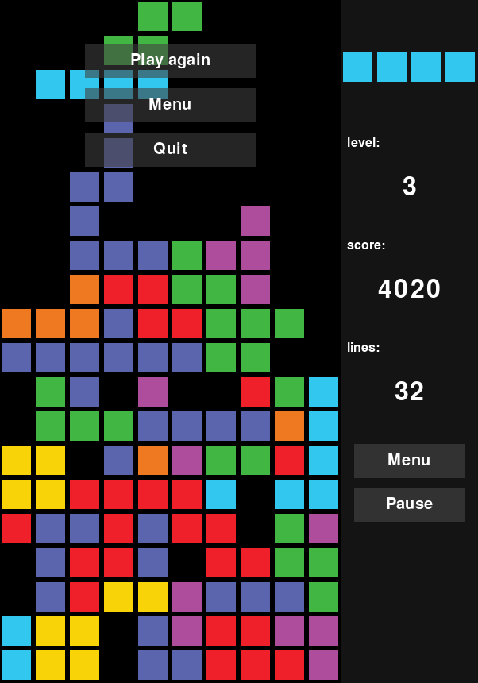

# Controls

- **Left Arrow:** Move Tetromino Left
- **Right Arrow:** Move Tetromino Right
- **Down Arrow:** Soft Drop (Accelerate Tetromino Down)
- **Z:** Rotate Tetromino Counterclockwise
- **X:** Rotate Tetromino Clockwise
- **P:** Pause/Resume Game

# Navigating the program

### Main menu

#### Main menu allows the user to navigate to different parts of the program:
- [Play](#play)
    - [During the game](#during-the-game)
    - [Game paused](#game-paused)
    - [Game over](#game-over)
- [Settings](#settings)
- [Github page](#github-page)
- [Quit](#quit)

## Play

### During the game

### Game paused

### Game over

## Settings

#### Settings allows the user to change various options controlling the game's visuals and gameplay:
- The "Random pieces" toggle can be switched to one of two modes for randomizing pieces:
    - When set to True, pieces are randomly chosen from the entire list of possible pieces each time.
    - When set to False, pieces are selected from a shuffled set of all possible piece types. Once the last piece is reached, the collection is shuffled again before the next selection.
- The "Next piece preview" toggle shows and hides the next piece preview (top right corner of the game screen).
- The "Animate line clear" toggle enables and disables the animation during line clear.
- The "Ghost piece" toggle enables and disables visibility of the [ghost piece](https://en.wiktionary.org/wiki/ghost_piece) on the game board.
- The "Ghost piece style" toggle switches between showing the ghost piece using outlines of the blocks or using the filled blocks.

## Github page
Clicking on this option takes the user to this Github repo.

## Quit
Exits the program